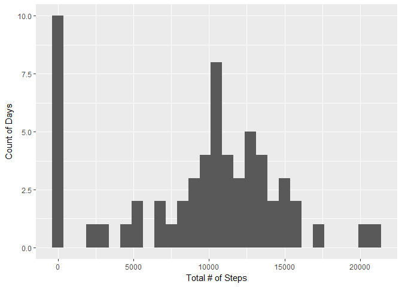
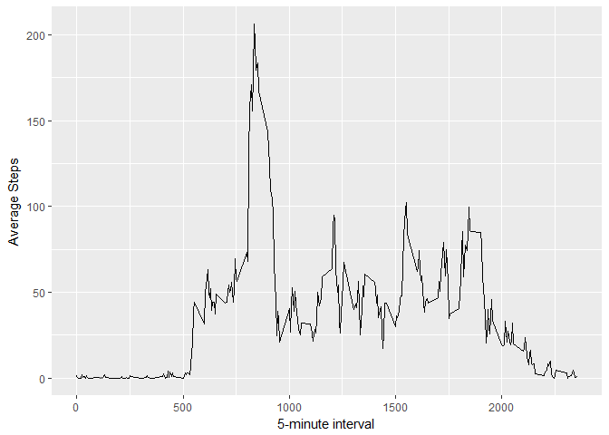
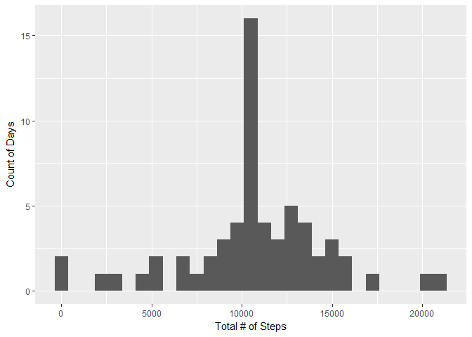
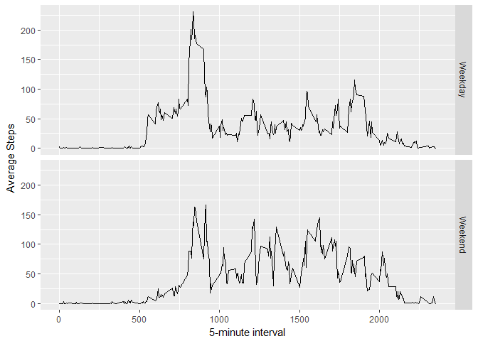

# Reproducible Research - Project 1
Vadim Sherman  
July 13, 2017  
## Loading and preprocessing the data


```r
library(ggplot2)
library(data.table)
library(dplyr)
library(dtplyr)

zipname <- "activity.zip"
fname <- "activity.csv"

if (!file.exists(fname)){
  unzip(zipname)
}

act <- read.csv(fname)
```


## What is mean total number of steps taken per day?


```r
#create data table with total steps per day and show as histogram
act.date <- group_by(act,date)

Total.steps.day <- summarise(act.date,steps = sum(steps, na.rm = TRUE))

ggplot(Total.steps.day,aes(steps)) + geom_histogram(binwidth = 750) + labs(x= "Total # of Steps", y = "Count of Days")
```

<!-- -->


```r
# mean of total number of steps taken per day
mean(Total.steps.day$steps)
```

```
## [1] 9354.23
```


```r
#median of toal number of steps taken per day
median(Total.steps.day$steps)
```

```
## [1] 10395
```


## What is the average daily activity pattern?


```r
## create data table average steps per every 5 minute intervals and create a time series plot
act.interval <- group_by(act,interval)

Average.steps.int <- summarise(act.interval, avg_steps = mean(steps,  na.rm = TRUE))

ggplot(Average.steps.int, aes(x = interval, y = avg_steps)) + 
geom_line() + labs(x = "5-minute interval", y = "Average Steps")
```

<!-- -->


```r
## Interval with the maximum average steps in the data table presented as data frame
as.data.frame(round(Average.steps.int[which.max(Average.steps.int$avg_steps),],2))
```

```
##   interval avg_steps
## 1      835    206.17
```


## Imputing missing values


```r
## sum of rows where steps are NA
sum(is.na(act$steps))
```

```
## [1] 2304
```


```r
## insert the average steps for the interaval for every row with NA steps

# Vector of indices where Steps are NA
act.na.ind <- which(is.na(act$steps))

# copy the activies data set
act.filled <- act

# Fill in average steps for each NA with the average steps from the corrisponding interval as double
for(i in act.na.ind){ act.filled[i,]$steps <- as.double(Average.steps.int[act[i, ]$interval ==  Average.steps.int$interval, "avg_steps"]) }
```


```r
#create a the filled data table with total steps per day and show as histogram
act.filled.date <- group_by(act.filled,date)

Total.filled.steps.day <- summarise(act.filled.date,steps = sum(steps, na.rm = TRUE))

ggplot(Total.filled.steps.day,aes(steps)) + geom_histogram(binwidth = 750) + labs(x= "Total # of Steps", y = "Count of Days")
```

<!-- -->


```r
# mean of total number of steps taken per day
mean(Total.filled.steps.day$steps)
```

```
## [1] 10766.19
```


```r
#median of toal number of steps taken per day
median(Total.filled.steps.day$steps)
```

```
## [1] 10766.19
```

Both the mean and the median have increased since as well as equaled since filling in the NAs. There has also been a significant drop in 0 values, which is due to the fact that the NAs were convereted to 0 in the orignal grouping by day. 

## Are there differences in activity patterns between weekdays and weekends?


```r
## Create new dataframe with two new columns weekday and day_type
act.filled.weeks <- mutate(act.filled, weekday = weekdays(as.Date(date)), day_type = ifelse(weekday == "Saturday" | weekday == "Sunday","Weekend","Weekday"))

## Group the dataframe by intervals and day_type
act.filled.int.type <- group_by(act.filled.weeks,interval,day_type)

Average.steps.int.type <- summarise(act.filled.int.type, avg_steps = mean(steps, na.rm = TRUE))

## Plot the 5 min intervals and average steps and split by day_type
ggplot(Average.steps.int.type, aes(interval, avg_steps)) + geom_line() + facet_grid(day_type~.) + 
    xlab("5-minute interval") + ylab("Average Steps")
```

<!-- -->


